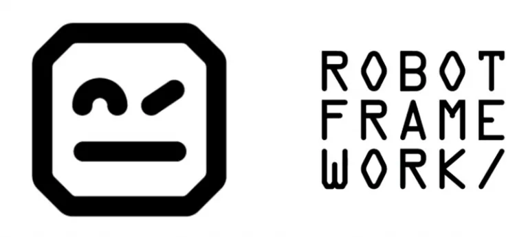

# Automação acesso swag labs - Sauce Demo

Automação das páginas do sauce demo

# Ferramentas
 - Python 3.11.4
 - Robot Framework

# Como utilizar

    - Vscode instalado
    - clonar repositório
    - cd swaglabs_robot
    - Criar .venv com python 3.11.4
    - Ativar .venv
    - Executar no terminal pip install -r requirements.txt
    - Executar os testes: robot    login_com_sucesso robot